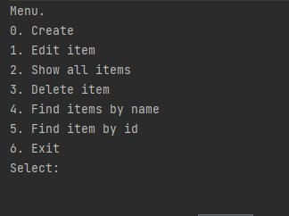

# job4j_tracker

Проект представляет из себя консольное приложение учёта заявок.
 

 
Все действия происходят в базе данных, используя Hibernate.
 
<h2>
  Установка и запуск
  </h2>
Проект собирается с помощью Maven в jar архив:
mvn install

Запуск:
java -jar target/tracker.jar

Email для связи: alexandrg3011@gmail.com
